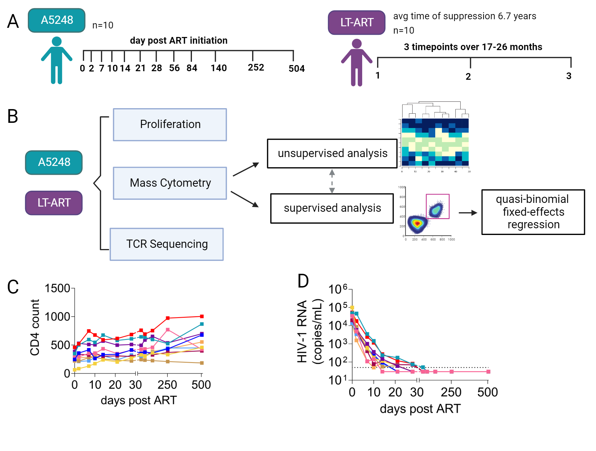

# immune-recovery
## CD4 T cell receptor hierarchies are stable and independent of HIV-mediated dysregulation of immune homeostasis
***Link publication here***

## CyTOF Data (**sent to Alexis to edit**)
Includes preprocessed CyTOF files (FCS format) from a 31-marker mass cytometry panel to examine all major PBMC lineages and specifically CD4 and CD8 T cell memory dynamics in people with HIV (PWH) who are durably ART suppressed for an average of 6.7 years (LT-ART, n=10) and PWH in the first 500 days following ART initiation (A5248, n=10). The panel also includes markers of activation (HLA-DR, CD38, CCR5), activation/exhaustion (PD-1), proliferation (Ki67), survival (Bcl-2) and long-lived memory (CD127).

### Cohort Summary 
<p align="center">
  
</p>

## Installation
You can clone the git repository by, 
```
git clone https://github.com/glab-hiv/immune-recovery.git
```

## Elastic Net Regression
### Dependencies
* Python >= 3.6, anndata 0.7.6, scanpy 1.8.1, numpy 1.19.5, scipy 1.7.1, leidenalg 0.8.7, flowkit 0.9.1, umap-learn 0.5.2, scikit-learn 0.24.1, phenograph 1.5.7

### Author
Jolene Ranek, <ranekj@live.unc.edu>

### Description
To ascertain immune cell phenotype and functional changes associated with initiation of antiretroviral therapy or durable suppression, a predictive elastic net regression model was trained on immune features that described the cell type composition and cell type signaling activity of profiled samples over time. Python scripts for preprocessing (preprocess.py, subsample.py), clustering (cluster.ipynb), and elastic net regression (run_elasticnet.ipynb) are described below. 

* `preprocess.py` - Creates a preprocessed __.h5ad__ data object for each patient cohort. This script parses FCS files from the CyTOF data folder and performs preprocessing by arcsinh transforming data with a cofactor of 5. 
* `subsample.py` - Downsamples data (2500 cells per patient sample) using [Kernel Herding sketching](https://dl.acm.org/doi/abs/10.1145/3535508.3545539).
* `cluster.ipynb` - Performs unsupervised meta-clustering on the downsampled data using the [PhenoGraph algorithm](https://pubmed.ncbi.nlm.nih.gov/26095251/).
* `run_elasticnet.ipynb` - Engineers descriptive mass cytometry immune features from unsupervised clusters (e.g. cell population frequency) and performs elastic net regression to identify changes in unsupervised cluster-derived features over time. 

## Quasi-Binomial Fixed-Effects Regression
### Dependencies
* R >= 4.2.2, ggplot2>=3.4.0, dplyr>=1.0.10, margins 0.3.26, writexl 1.4.1

### Author
Ann Marie Weideman, <anndo1@umbc.edu> (preferred) or <anndo1@live.unc.edu>

### Description
To examine whether there was a change in leukocyte populations and subpopulations over time, a [quasi-binomial fixed-effects regression](https://books.google.com/books/about/Generalized_Linear_Models_Second_Edition.html?id=h9kFH2_FfBkC) with indicators for participant ID (PID) was fit separately to the data from each cohort (PWH-ART and ACTG5248) using the data in the CyTOF Data folder. Each R script described below plots the data to check model assumptions (e.g., linearity to the logit), fits a separate model for each population, and outputs the slope estimates and corresponding confidence assessments with accompanying interpretation. 

* `FEreg_CD4.r` quasi-binomial fixed-effects regression for CD4 T cell memory dynamics. 
* `FEreg_CD8.r` quasi-binomial fixed-effects regression for CD8 T cell memory dynamics. 
